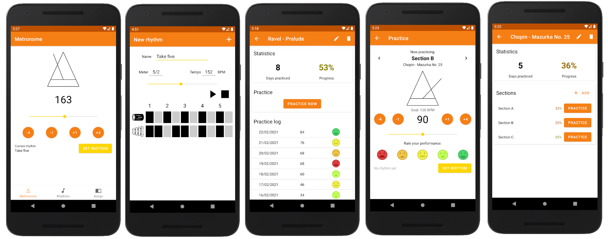

# Instrument practice assistant & metronome 
[Polski](./README-en.md)

[App in the Google Play store](https://play.google.com/store/apps/details?id=jwer.pam)

## Application
This repository contains the source code on an Android app that imitates a metronome as well as allows tracking instrument practice progress. The app allows:
* Using a regular metronome
* Loading custom rhythms (created from within the app) onto the metronome
* Managing a list of practiced songs
* Entering practice data - how well the user perform the song in a given tempo
* Browsing practice statistics

## Running
The app is available for free at the [Google Play](https://play.google.com/store/apps/details?id=jwer.pam) store. It can be installed only on devices on a mobile device with Android 8.0 or higher.